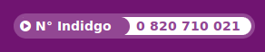

# Confirmation Link

CSS-only mechanism to render a _numéro vert_, _numéro indigo_.

# Preview

# Usage

1. Import the scss in your main stylesheet `@import 'phone-ribbon'; ` ;
2. include template to your page.
3. Enjoy!